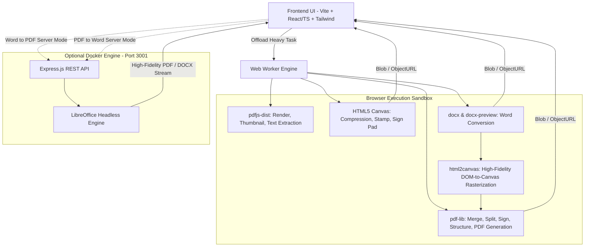

# Product Requirements Document (PRD)

## Andesa PDF (Toolkit PDF Tanpa Batas & Free)

---

### 1. Executive Summary

Andesa PDF adalah web application suite utilitas PDF all-in-one yang beroperasi **tanpa batas dan 100% free** tanpa batasan kuota penggunaan, tanpa paywall, dan tanpa registrasi akun.

Aplikasi mengadopsi arsitektur hybrid modern: modul manipulasi dasar (merging, splitting, compression, signing, JPG-to-PDF, Markdown) diproses instan langsung di peramban pengguna, sementara modul konversi dokumen tingkat lanjut (Word ke PDF dan PDF ke Word) didukung oleh integrasi backend microservice converter dengan fallback mulus ke engine lokal browser.

Aplikasi dibangun dengan stack **Vite + TypeScript + Tailwind CSS** menggunakan **Light Theme** modern, berlisensi **MIT License** (Open Source), mengedepankan performa tinggi, UI mobile-first yang responsif, serta kenyamanan pemrosesan berkas tanpa batasan.

---

### 2. Problem Statement

1. **Privasi & Keamanan Data**: Layanan umum (iLovePDF, SmallPDF) mewajibkan pengguna mengunggah dokumen ke server cloud mereka. Dokumen sensitif berisiko mengalami kebocoran data atau melanggar regulasi privasi perusahaan (NDA/GDPR).
2. **Paywall & Batasan Kuota**: Layanan komersial membatasi jumlah operasi per hari atau ukuran file untuk pengguna gratis.
3. **Ketergantungan Bandwidth**: Mengunggah dan mengunduh ulang file berukuran besar menghabiskan kuota data dan lambat pada jaringan internet tidak stabil.

---

### 3. Goals & Objectives

| Tujuan                        | Target                                                              |
| ----------------------------- | ------------------------------------------------------------------- |
| **Tanpa Batas Kuota & Biaya** | 100% free tanpa kuota harian atau paywall tersembunyi              |
| **Hybrid Conversion Engine**  | Konversi dokumen presisi tinggi via backend dengan fallback lokal  |
| **Comprehensive MVP Toolkit** | 8 modul utama siap pakai di peluncuran perdana                      |
| **Blazing Fast Execution**    | Operasi standar (merge/split/jpg-to-pdf) selesai < 2 detik          |
| **Zero Friction**             | Tidak ada login, tidak ada database, langsung drag-and-drop         |

---

### 4. User Personas

1. **Corporate / Legal Professional (Budi, 34)**:
   - _Kebutuhan_: Menggabungkan kontrak dan menandatangani dokumen NDA.
   - _Pain Point_: Dilarang mengunggah file ke situs pihak ketiga oleh aturan compliance IT kantor.
2. **Mahasiswa / Akademisi (Siti, 21)**:
   - _Kebutuhan_: Memisahkan bab jurnal, kompres tugas PDF agar muat di portal kampus, convert materi ke Markdown.
   - _Pain Point_: Kuota harian habis di situs web komersial berbayar.
3. **Pekerja Lepas / Freelancer (Rian, 28)**:
   - _Kebutuhan_: Mengubah invoice JPG ke PDF, memberi tanda tangan digital instan di mana saja.
   - _Pain Point_: Malas instal software desktop berat seperti Adobe Acrobat.

---

### 5. Scope

#### In-Scope (MVP)

- **Modul 1: Merge PDF** (Gabung banyak PDF, atur urutan halaman).
- **Modul 2: Split PDF** (Ekstrak rentang halaman spesifik atau pecah per halaman).
- **Modul 3: JPG/PNG to PDF** (Konversi gambar ke PDF dengan pengaturan ukuran halaman & margin).
- **Modul 4: Sign / TTD PDF** (Gambar tanda tangan, atur posisi, ukuran, dan halaman target).
- **Modul 5: PDF to Markdown** (Ekstrak struktur teks, heading, dan paragraf ke format Markdown).
- **Modul 6: Kompresi PDF** (Canvas downsampling & stream optimization dengan opsi level kualitas).
- **Modul 7: Word (.docx) to PDF** (Parsing client-side via rendering canvas/DOM ke PDF).
- **Modul 8: PDF to Word (.docx)** (Ekstrak teks terstruktur ke dokumen docx lokal).
- **Dashboard UI**: Katalog alat modular, dark/light theme, drag-and-drop zone.

#### Out-of-Scope (Fase Lanjutan)

- Optical Character Recognition (OCR) multi-bahasa berbasis Tesseract WASM berat (direncanakan v1.1).
- PDF Password Decryption / Encryption canggih (AES-256 permission manipulation).
- Kolaborasi multi-user realtime.

---

### 6. User Stories & Acceptance Criteria

#### US-01: Merge PDF

- **Cerita**: Sebagai pengguna, saya ingin menggabungkan beberapa file PDF menjadi satu file urut agar dokumen tersusun rapi.
- **Kriteria Penerimaan**:
  - Pengguna dapat memilih 2 atau lebih file PDF via drag-and-drop atau file picker.
  - Pengguna dapat mengubah urutan file secara visual (drag-to-reorder thumbnail).
  - File hasil gabungan terunduh secara instan dengan penamaan kustom.

#### US-02: Split PDF

- **Cerita**: Sebagai pengguna, saya ingin memisahkan halaman tertentu dari file PDF agar hanya menyimpan bagian yang relevan.
- **Kriteria Penerimaan**:
  - Menampilkan thumbnail semua halaman PDF.
  - Pengguna dapat memasukkan format rentang halaman (misal `1-3, 5, 8-10`) atau klik thumbnail untuk memilih.
  - Menghasilkan 1 file PDF hasil ekstraksi atau file `.zip` berisi halaman terpisah.

#### US-03: JPG / PNG to PDF

- **Cerita**: Sebagai pengguna, saya ingin mengubah foto dokumen/nota menjadi file PDF.
- **Kriteria Penerimaan**:
  - Menerima format `.jpg`, `.jpeg`, `.png`, `.webp`.
  - Pilihan orientasi (Portrait / Landscape) dan ukuran kertas (A4 / Fit to Image).
  - Pilihan margin (Tanpa margin, Small, Big).

#### US-04: TTD / E-Signature PDF

- **Cerita**: Sebagai pengguna, saya ingin membubuhkan tanda tangan langsung ke dokumen PDF.
- **Kriteria Penerimaan**:
  - Kanvas tanda tangan halus (mouse/touch support) dengan opsi hapus/reset.
  - Alternatif upload file gambar tanda tangan transparan (PNG).
  - Tanda tangan dapat di-drag, di-resize, dan diposisikan presisi di atas preview halaman PDF.
  - Tanda tangan di-render permanen (flattened) ke file PDF output.

#### US-05: PDF to Markdown

- **Cerita**: Sebagai pengguna, saya ingin mengekstrak teks dari PDF ke Markdown untuk catatan atau prompt AI dengan struktur heading, paragraf, dan daftar yang rapi.
- **Kriteria Penerimaan**:
  - Ekstrak teks halaman per halaman menggunakan `pdfjs-dist` dengan pengurutan spasial koordinat (top-to-bottom, left-to-right).
  - Rekonstruksi struktur heading hierarkis (`#`, `##`, `###`) otomatis berdasarkan analisis ukuran font dominan dokumen dan bobot font (bold).
  - Smart paragraph joining: menyambung kalimat bersambung tanpa hard line breaks dan de-hyphenation kata yang terpotong (`-`), dengan tetap memisahkan paragraf pada jarak baris vertikal.
  - Normalisasi list item: konversi simbol bullet (`•`, `●`, `▪`, dll.) menjadi format `- item` dan penataan nomor teratur.
  - Deteksi monospace code block (```).
  - Kontrol konfigurasi konversi: Toggle Gabungkan Paragraf Cerdas, Deteksi Heading, dan Pemisah Halaman (`---`).
  - Indikator statistik ekstraksi (jumlah halaman, kata, karakter), tombol Salin ke Clipboard, dan Unduh berkas `.md`.

#### US-06: Kompresi PDF

- **Cerita**: Sebagai pengguna, saya ingin memperkecil ukuran file PDF agar dapat diunggah ke portal lowongan atau email.
- **Kriteria Penerimaan**:
  - Preset kompresi: Ekstrem (kualitas gambar rendah), Sedang (rekomendasi), Ringan (kualitas tinggi).
  - Menampilkan estimasi ukuran awal vs ukuran akhir.
  - Menggunakan Web Worker agar browser tidak mengalami freeze selama proses rendering canvas.

#### US-07: Word (.docx) to PDF

- **Cerita**: Sebagai pengguna, saya ingin mengubah file Word menjadi PDF langsung dengan tata letak, tabel, dan format visual yang 100% presisi mendekati Microsoft Word asli.
- **Kriteria Penerimaan**:
  - Menerima file format `.docx`.
  - **Arsitektur Hybrid**:
    - **Server Microservice Engine (Utama)**: Mengirimkan dokumen ke backend Node.js Express (`server/`) yang menjalankan engine **LibreOffice Headless** (`soffice`) dalam Docker container (`docker-compose.yml`) untuk konversi 99% presisi tinggi dengan render tabel, border, kolom, font asli, dan tanda tangan resmi.
    - **Browser Client-Side Engine (Fallback Otomatis)**: Jika backend offline atau tidak tersedia, sistem otomatis beralih ke rendering lokal browser menggunakan pipeline `docx-preview` + `html2canvas` (2x DPI) + vertical page slicing `pdf-lib` tanpa mengalami crash atau teks bertumpuk.
  - Resolusi tajam dan output berkas PDF standar A4 (595.28 x 841.89 pt).

#### US-08: PDF to Word (.docx)

- **Cerita**: Sebagai pengguna, saya ingin mengonversi dokumen PDF menjadi file Word (.docx) yang dapat diedit dengan format, tata letak, dan struktur dokumen yang tetap utuh dan presisi.
- **Kriteria Penerimaan**:
  - Menerima file input `.pdf`.
  - **Arsitektur Hybrid**:
    - **Server Microservice Engine (Utama)**: Mengirimkan berkas PDF ke backend Node.js Express (`server/`) yang menjalankan LibreOffice Headless dengan filter import `writer_pdf_import` (`--headless --infilter=writer_pdf_import --convert-to docx`) dalam Docker container (`docker-compose.yml`) untuk rekonstruksi visual dokumen berpresisi tinggi (tabel, paragraf, font, dan format asli).
    - **Browser Client-Side Engine (Fallback Otomatis)**: Jika backend offline atau tidak terjangkau, aplikasi otomatis beralih ke ekstraksi teks lokal di browser menggunakan `pdfjs-dist` dan pembuatan berkas `.docx` melalui pustaka `docx`.
  - File `.docx` hasil konversi dapat diedit di Microsoft Word, Google Docs, dan LibreOffice Writer.

---

### 7. Technical Considerations & Architecture



#### Library & Backend Selection

1. **`server/` (Node.js Express + LibreOffice Microservice)**: Endpoint `POST /api/convert/word-to-pdf` dan `POST /api/convert/pdf-to-word` untuk memproses konversi dokumen DOCX dan PDF dengan engine native LibreOffice headless di dalam Docker (`Dockerfile` & `docker-compose.yml`).
2. **`pdf-lib`**: Manipulasi struktur PDF (merge, split, embed image, draw text, page packaging). Ringan (~300KB), bebas ketergantungan native.
3. **`pdfjs-dist`**: Render halaman PDF ke `<canvas>` untuk thumbnail, preview visual, dan ekstraksi teks untuk PDF-to-Markdown.
4. **`docx` & `docx-preview`**: Parsing `.docx` ke DOM dan pembuatan dokumen Word client-side.
5. **`html2canvas`**: Render struktur visual DOM dari `docx-preview` ke canvas resolusi tinggi (2x DPI) untuk fallback lokal Word to PDF.
6. **HTML5 Canvas API**: Signature pad, image downsampling untuk kompresi raster, dan vertical page slicing.
7. **Web Workers API**: Menjalankan konversi berat di background thread untuk menjaga UI tetap 60fps.

#### Memory Management

- Penggunaan `URL.createObjectURL(blob)` dan pemanggilan wajib `URL.revokeObjectURL(url)` setelah unduhan selesai untuk mencegah memory leaks.
- Batasan rekomendasi ukuran file: hingga 50MB per file untuk menjaga stabilitas RAM browser mobile/desktop.

---

### 8. Design & UX Requirements

- **Design Style**: Modern Light Theme, clean card layout, antislop-ui standard (tanpa elemen mengambang berlebih, kontras tinggi WCAG AA).
- **Color Palette**: Light Slate (`#f8fafc` background, `#ffffff` card surface, `#e2e8f0` border) dengan teks kontras `#0f172a` dan aksen Indigo (`#4f46e5`). Indikator privasi hijau emerald (`#059669`).
- **Mobile-First Responsive**: Tap target minimal 44px, grid reflow adaptif untuk layar smartphone, zero horizontal overflow.
- **Testing Framework**: Unit test suite berbasis **Jest** dan `ts-jest` di folder `tests/`.
- **Drag-and-Drop Zone**: Indikator visual jelas saat file di-drag masuk.
- **Thumbnail Page Reorder**: Drag-and-drop interaktif untuk mengatur urutan halaman.

---

### 9. Success Metrics

| Metrik                                  | Target                  | Metode Pengukuran                     |
| --------------------------------------- | ----------------------- | ------------------------------------- |
| **Local Processing Time (Merge/Split)** | < 2 detik (file < 20MB) | Performance API (console timer)       |
| **Network Requests**                    | 0 file data upload      | Audit via Chrome DevTools Network Tab |
| **Crash Rate / OOM**                    | < 1% pada file standar  | Error Boundary catching               |
| **Lighthouse Performance Score**        | >= 90                   | Google Lighthouse Audit               |

---

### 10. Risks & Mitigations

| Risiko                                  | Dampak                                      | Mitigasi                                                          |
| --------------------------------------- | ------------------------------------------- | ----------------------------------------------------------------- |
| **Format Word tidak 100% akurat**       | Hasil konversi Word <-> PDF bergeser        | Berikan live preview sebelum download dan disclaimer visual jelas |
| **Out-of-Memory (OOM) pada file besar** | Tab browser crash                           | Peringatan kapasitas file (>50MB) + batch processing per halaman  |
| **Browser Safari/Mobile canvas limits** | Kegagalan kompresi pada PDF ratusan halaman | Chunked canvas processing dan pelepasan memori bertahap           |

---

### 11. Timeline & Phasing

- **Milestone 1 (Fondasi & Core PDF)**: Setup Vite + TS + Tailwind, integrasi `pdf-lib` untuk Merge, Split, dan JPG-to-PDF.
- **Milestone 2 (Anotasi & Teks)**: Signature Pad (TTD) dan PDF to Markdown (via `pdfjs-dist`).
- **Milestone 3 (Heavy Processing)**: Kompresi via Canvas Worker, Word to PDF, dan PDF to Word.
- **Milestone 4 (UI Polish & Testing)**: Responsive design, drag-drop reordering, audit zero-leakage, dan build optimasi.

---

### 12. Licensing & Distribution Policy

- **Lisensi**: **MIT License**.
- **Pemegang Hak Cipta**: Copyright (c) 2026 Andrianto Nur Iskandar.
- **Ketentuan Lisensi**:
  - Proyek bersifat open source bebas biaya.
  - Penggunaan pribadi, edukasi, maupun komersial diperbolehkan tanpa batasan royalti.
  - Modifikasi kode, bundling ke produk lain, dan distribusi ulang diizinkan selama menyertakan pemberitahuan hak cipta asli (_copyright notice_) dan teks lisensi MIT.
  - Perangkat lunak disediakan tanpa jaminan apa pun (_AS IS_).

---

### 13. Project Documentation

- **README.md**: Dokumentasi esensial untuk developer dan pengguna, mencakup ikhtisar ringkas fitur, garansi privasi client-side, panduan setup lokal (`npm run dev`, `npm run build`, `npm test`, `npm run lint`, `npm run lint:fix`), serta tautan lisensi.
  - **Status Badges**: Dilengkapi status badges resmi dari Shields.io untuk GitHub display:
    - *App Version*: Dynamic sync via `img.shields.io/github/package-json/v/Andrianto15/andesa-pdf-utility`.
    - *NPM Version*: Custom badge terstruktur `img.shields.io/badge/npm-v0.1.3-CB3837?logo=npm` terhubung ke direktori npm `andesa-pdf`.
    - *License*: MIT badge dari GitHub repository metadata.
    - *Test Suite*: Status kelulusan test suite Jest.
    - *Tech Stack*: Badge ekosistem Node.js, TypeScript, Vite, dan Tailwind CSS.
    - *Community*: Badge `PRs welcome`.
- **PRD.md**: Spesifikasi fungsional, arsitektur teknis, kriteria penerimaan, dan acuan implementasi mendalam.

---

### 14. Code Quality & Linting Standards

- **Linter Engine**: ESLint flat config (`eslint.config.js`) terintegrasi dengan `@eslint/js` dan `typescript-eslint`.
- **Eksekusi Skrip**:
  - `npm run lint`: Memvalidasi seluruh file TypeScript/JavaScript terhadap aturan kode dan standar type safety.
  - `npm run lint:fix` / `npm run fix:lint`: Menjalankan autofix otomatis untuk masalah format dan linting yang dapat diperbaiki.
- **Kebijakan Kualitas**: Seluruh commit wajib lolos linting tanpa error sebelum dilakukan build produksi dan perilisan.

---

### 15. Branding & Identity Standards

- **Nama Aplikasi Resmi**: **Andesa PDF**.
- **Slug Package**: `andesa-pdf` (`package.json`, `package-lock.json`).
- **Tagline & Nilai Utama**: Tanpa Batas & Free (Bebas Biaya, Tanpa Batasan Kuota).
- **Komponen Identitas UI**:
  - Header: Menampilkan teks `Andesa PDF` dengan badge `Tanpa Batas`, subjudul `Tanpa Batas • Bebas Biaya • 100% Free`, dan pill `Tanpa Batas & Free`.
  - Footer: Menampilkan label `Andesa PDF - Toolkit PDF Tanpa Batas & Free`, indikator `Tanpa Batas Kuota`, serta pemberitahuan hak cipta `© 2026 Andrian Tonur Iskandar. All rights reserved.` dan tautan lisensi MIT.
  - Hero: Menampilkan `Toolkit PDF Lengkap Tanpa Batas & 100% Free` dan `Tanpa Batas dan Bebas Biaya`.
  - Halaman Web (`index.html`): Title tag `Andesa PDF - Utilitas PDF Tanpa Batas & Free` dan meta description yang selaras.
  - Nama Berkas Output: File PDF hasil ekspor menggunakan prefix default `andesa-pdf-*.pdf`.
- **Verifikasi Unit Test**: Suite pengujian `tests/branding.test.ts` memverifikasi konsistensi nama merek, branding Tanpa Batas & Free, dan copyright footer pada package.json, index.html, dan komponen UI.


