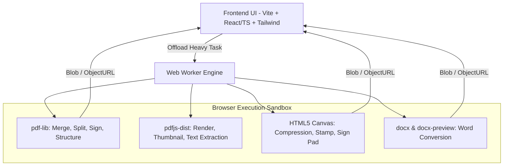

# Product Requirements Document (PRD)

## Andesa PDF (Zero-Server Client-Side PDF Utilities)

---

### 1. Executive Summary

Andesa PDF adalah web application suite utilitas PDF all-in-one yang beroperasi **100% di sisi klien (in-browser)** tanpa database, tanpa backend server untuk pemrosesan file, dan tanpa registrasi akun.

Semua manipulasi file (merging, splitting, conversion, signing, kompresi) dieksekusi langsung pada CPU/memori perangkat pengguna menggunakan JavaScript, WebAssembly (WASM), dan Web Workers. Andesa PDF menawarkan privasi total: dokumen rahasia (KTP, kontrak, laporan keuangan) tidak pernah dikirim melalui jaringan internet.

Aplikasi dibangun dengan stack **Vite + TypeScript + Tailwind CSS** menggunakan **Light Theme** modern, berlisensi **MIT License** (Open Source & memperbolehkan modifikasi/komersialisasi dengan menyertakan copyright notice), mengedepankan performa tinggi, UI mobile-first yang responsif, serta pemrosesan file yang aman dan cepat.

---

### 2. Problem Statement

1. **Privasi & Keamanan Data**: Layanan umum (iLovePDF, SmallPDF) mewajibkan pengguna mengunggah dokumen ke server cloud mereka. Dokumen sensitif berisiko mengalami kebocoran data atau melanggar regulasi privasi perusahaan (NDA/GDPR).
2. **Paywall & Batasan Kuota**: Layanan komersial membatasi jumlah operasi per hari atau ukuran file untuk pengguna gratis.
3. **Ketergantungan Bandwidth**: Mengunggah dan mengunduh ulang file berukuran besar menghabiskan kuota data dan lambat pada jaringan internet tidak stabil.

---

### 3. Goals & Objectives

| Tujuan                        | Target                                                              |
| ----------------------------- | ------------------------------------------------------------------- |
| **Zero Server Transmission**  | 100% proses dokumen lokal di memori browser                         |
| **Zero Backend Cost**         | Web dapat di-host statis (Cloudflare Pages / Vercel / GitHub Pages) |
| **Comprehensive MVP Toolkit** | 8 modul utama siap pakai di peluncuran perdana                      |
| **Blazing Fast Execution**    | Operasi standar (merge/split/jpg-to-pdf) selesai < 2 detik          |
| **Zero Friction**             | Tidak ada login, tidak ada database, langsung drag-and-drop         |

---

### 4. User Personas

1. **Corporate / Legal Professional (Budi, 34)**:
   - _Kebutuhan_: Menggabungkan kontrak dan menandatangani dokumen NDA.
   - _Pain Point_: Dilarang mengunggah file ke situs pihak ketiga oleh aturan compliance IT kantor.
2. **Mahasiswa / Akademisi (Siti, 21)**:
   - _Kebutuhan_: Memisahkan bab jurnal, kompres tugas PDF agar muat di portal kampus, convert materi ke Markdown.
   - _Pain Point_: Kuota harian habis di situs web komersial berbayar.
3. **Pekerja Lepas / Freelancer (Rian, 28)**:
   - _Kebutuhan_: Mengubah invoice JPG ke PDF, memberi tanda tangan digital instan di mana saja.
   - _Pain Point_: Malas instal software desktop berat seperti Adobe Acrobat.

---

### 5. Scope

#### In-Scope (MVP)

- **Modul 1: Merge PDF** (Gabung banyak PDF, atur urutan halaman).
- **Modul 2: Split PDF** (Ekstrak rentang halaman spesifik atau pecah per halaman).
- **Modul 3: JPG/PNG to PDF** (Konversi gambar ke PDF dengan pengaturan ukuran halaman & margin).
- **Modul 4: Sign / TTD PDF** (Gambar tanda tangan, atur posisi, ukuran, dan halaman target).
- **Modul 5: PDF to Markdown** (Ekstrak struktur teks, heading, dan paragraf ke format Markdown).
- **Modul 6: Kompresi PDF** (Canvas downsampling & stream optimization dengan opsi level kualitas).
- **Modul 7: Word (.docx) to PDF** (Parsing client-side via rendering canvas/DOM ke PDF).
- **Modul 8: PDF to Word (.docx)** (Ekstrak teks terstruktur ke dokumen docx lokal).
- **Dashboard UI**: Katalog alat modular, dark/light theme, drag-and-drop zone.

#### Out-of-Scope (Fase Lanjutan)

- Optical Character Recognition (OCR) multi-bahasa berbasis Tesseract WASM berat (direncanakan v1.1).
- PDF Password Decryption / Encryption canggih (AES-256 permission manipulation).
- Kolaborasi multi-user realtime.

---

### 6. User Stories & Acceptance Criteria

#### US-01: Merge PDF

- **Cerita**: Sebagai pengguna, saya ingin menggabungkan beberapa file PDF menjadi satu file urut agar dokumen tersusun rapi.
- **Kriteria Penerimaan**:
  - Pengguna dapat memilih 2 atau lebih file PDF via drag-and-drop atau file picker.
  - Pengguna dapat mengubah urutan file secara visual (drag-to-reorder thumbnail).
  - File hasil gabungan terunduh secara instan dengan penamaan kustom.

#### US-02: Split PDF

- **Cerita**: Sebagai pengguna, saya ingin memisahkan halaman tertentu dari file PDF agar hanya menyimpan bagian yang relevan.
- **Kriteria Penerimaan**:
  - Menampilkan thumbnail semua halaman PDF.
  - Pengguna dapat memasukkan format rentang halaman (misal `1-3, 5, 8-10`) atau klik thumbnail untuk memilih.
  - Menghasilkan 1 file PDF hasil ekstraksi atau file `.zip` berisi halaman terpisah.

#### US-03: JPG / PNG to PDF

- **Cerita**: Sebagai pengguna, saya ingin mengubah foto dokumen/nota menjadi file PDF.
- **Kriteria Penerimaan**:
  - Menerima format `.jpg`, `.jpeg`, `.png`, `.webp`.
  - Pilihan orientasi (Portrait / Landscape) dan ukuran kertas (A4 / Fit to Image).
  - Pilihan margin (Tanpa margin, Small, Big).

#### US-04: TTD / E-Signature PDF

- **Cerita**: Sebagai pengguna, saya ingin membubuhkan tanda tangan langsung ke dokumen PDF.
- **Kriteria Penerimaan**:
  - Kanvas tanda tangan halus (mouse/touch support) dengan opsi hapus/reset.
  - Alternatif upload file gambar tanda tangan transparan (PNG).
  - Tanda tangan dapat di-drag, di-resize, dan diposisikan presisi di atas preview halaman PDF.
  - Tanda tangan di-render permanen (flattened) ke file PDF output.

#### US-05: PDF to Markdown

- **Cerita**: Sebagai pengguna, saya ingin mengekstrak teks dari PDF ke Markdown untuk catatan atau prompt AI.
- **Kriteria Penerimaan**:
  - Ekstrak teks halaman per halaman menggunakan `pdfjs-dist`.
  - Rekonstruksi struktur heading berdasarkan font size / weight.
  - Tombol Copy to Clipboard dan Download `.md`.

#### US-06: Kompresi PDF

- **Cerita**: Sebagai pengguna, saya ingin memperkecil ukuran file PDF agar dapat diunggah ke portal lowongan atau email.
- **Kriteria Penerimaan**:
  - Preset kompresi: Ekstrem (kualitas gambar rendah), Sedang (rekomendasi), Ringan (kualitas tinggi).
  - Menampilkan estimasi ukuran awal vs ukuran akhir.
  - Menggunakan Web Worker agar browser tidak mengalami freeze selama proses rendering canvas.

#### US-07: Word (.docx) to PDF

- **Cerita**: Sebagai pengguna, saya ingin mengubah file Word menjadi PDF langsung di browser.
- **Kriteria Penerimaan**:
  - Menerima file format `.docx`.
  - Mengonversi elemen teks, tabel dasar, dan styling ke representasi PDF.
  - Menampilkan warning/preview batas tata letak format kompleks.

#### US-08: PDF to Word (.docx)

- **Cerita**: Sebagai pengguna, saya ingin mengonversi dokumen PDF menjadi file Word yang dapat diedit.
- **Kriteria Penerimaan**:
  - Mengekstrak teks dan paragraf dari PDF ke file `.docx` baru menggunakan pustaka docx.
  - File `.docx` hasil konversi dapat dibuka di Microsoft Word / Google Docs / LibreOffice.

---

### 7. Technical Considerations & Architecture

#### Library Selection

1. **`pdf-lib`**: Manipulasi struktur PDF (merge, split, embed image, draw text, delete pages). Ringan (~300KB), bebas ketergantungan native.
2. **`pdfjs-dist`**: Render halaman PDF ke `<canvas>` untuk thumbnail, preview visual, dan ekstraksi teks untuk PDF-to-Markdown.
3. **`docx` & `docx-preview`**: Parsing `.docx` ke DOM dan pembuatan dokumen Word client-side.
4. **HTML5 Canvas API**: Signature pad dan image downsampling untuk kompresi raster.
5. **Web Workers API**: Menjalankan konversi berat di background thread untuk menjaga UI tetap 60fps.

#### Memory Management

- Penggunaan `URL.createObjectURL(blob)` dan pemanggilan wajib `URL.revokeObjectURL(url)` setelah unduhan selesai untuk mencegah memory leaks.
- Batasan rekomendasi ukuran file: hingga 50MB per file untuk menjaga stabilitas RAM browser mobile/desktop.

---

### 8. Design & UX Requirements

- **Design Style**: Modern Light Theme, clean card layout, antislop-ui standard (tanpa elemen mengambang berlebih, kontras tinggi WCAG AA).
- **Color Palette**: Light Slate (`#f8fafc` background, `#ffffff` card surface, `#e2e8f0` border) dengan teks kontras `#0f172a` dan aksen Indigo (`#4f46e5`). Indikator privasi hijau emerald (`#059669`).
- **Mobile-First Responsive**: Tap target minimal 44px, grid reflow adaptif untuk layar smartphone, zero horizontal overflow.
- **Testing Framework**: Unit test suite berbasis **Jest** dan `ts-jest` di folder `tests/`.
- **Drag-and-Drop Zone**: Indikator visual jelas saat file di-drag masuk.
- **Thumbnail Page Reorder**: Drag-and-drop interaktif untuk mengatur urutan halaman.

---

### 9. Success Metrics

| Metrik                                  | Target                  | Metode Pengukuran                     |
| --------------------------------------- | ----------------------- | ------------------------------------- |
| **Local Processing Time (Merge/Split)** | < 2 detik (file < 20MB) | Performance API (console timer)       |
| **Network Requests**                    | 0 file data upload      | Audit via Chrome DevTools Network Tab |
| **Crash Rate / OOM**                    | < 1% pada file standar  | Error Boundary catching               |
| **Lighthouse Performance Score**        | >= 90                   | Google Lighthouse Audit               |

---

### 10. Risks & Mitigations

| Risiko                                  | Dampak                                      | Mitigasi                                                          |
| --------------------------------------- | ------------------------------------------- | ----------------------------------------------------------------- |
| **Format Word tidak 100% akurat**       | Hasil konversi Word <-> PDF bergeser        | Berikan live preview sebelum download dan disclaimer visual jelas |
| **Out-of-Memory (OOM) pada file besar** | Tab browser crash                           | Peringatan kapasitas file (>50MB) + batch processing per halaman  |
| **Browser Safari/Mobile canvas limits** | Kegagalan kompresi pada PDF ratusan halaman | Chunked canvas processing dan pelepasan memori bertahap           |

---

### 11. Timeline & Phasing

- **Milestone 1 (Fondasi & Core PDF)**: Setup Vite + TS + Tailwind, integrasi `pdf-lib` untuk Merge, Split, dan JPG-to-PDF.
- **Milestone 2 (Anotasi & Teks)**: Signature Pad (TTD) dan PDF to Markdown (via `pdfjs-dist`).
- **Milestone 3 (Heavy Processing)**: Kompresi via Canvas Worker, Word to PDF, dan PDF to Word.
- **Milestone 4 (UI Polish & Testing)**: Responsive design, drag-drop reordering, audit zero-leakage, dan build optimasi.

---

### 12. Licensing & Distribution Policy

- **Lisensi**: **MIT License**.
- **Pemegang Hak Cipta**: Copyright (c) 2026 Andrianto Nur Iskandar.
- **Ketentuan Lisensi**:
  - Proyek bersifat open source bebas biaya.
  - Penggunaan pribadi, edukasi, maupun komersial diperbolehkan tanpa batasan royalti.
  - Modifikasi kode, bundling ke produk lain, dan distribusi ulang diizinkan selama menyertakan pemberitahuan hak cipta asli (_copyright notice_) dan teks lisensi MIT.
  - Perangkat lunak disediakan tanpa jaminan apa pun (_AS IS_).

---

### 13. Project Documentation

- **README.md**: Dokumentasi esensial untuk developer dan pengguna, mencakup ikhtisar ringkas fitur, garansi privasi client-side, panduan setup lokal (`npm run dev`, `npm run build`, `npm test`, `npm run lint`, `npm run lint:fix`), serta tautan lisensi.
- **PRD.md**: Spesifikasi fungsional, arsitektur teknis, kriteria penerimaan, dan acuan implementasi mendalam.

---

### 14. Code Quality & Linting Standards

- **Linter Engine**: ESLint flat config (`eslint.config.js`) terintegrasi dengan `@eslint/js` dan `typescript-eslint`.
- **Eksekusi Skrip**:
  - `npm run lint`: Memvalidasi seluruh file TypeScript/JavaScript terhadap aturan kode dan standar type safety.
  - `npm run lint:fix` / `npm run fix:lint`: Menjalankan autofix otomatis untuk masalah format dan linting yang dapat diperbaiki.
- **Kebijakan Kualitas**: Seluruh commit wajib lolos linting tanpa error sebelum dilakukan build produksi dan perilisan.

---

### 15. Branding & Identity Standards

- **Nama Aplikasi Resmi**: **Andesa PDF**.
- **Slug Package**: `andesa-pdf` (`package.json`, `package-lock.json`).
- **Komponen Identitas UI**:
  - Header: Menampilkan teks `Andesa PDF` dengan badge `Client-Side` dan deskripsi responsif.
  - Footer: Menampilkan label `Andesa PDF - Client-Side PDF Toolkit`.
  - Halaman Web (`index.html`): Title tag `Andesa PDF - Utilitas PDF 100% Client-Side (Zero Server, Zero Limit)` dan meta description yang selaras.
  - Nama Berkas Output: File PDF hasil ekspor menggunakan prefix default `andesa-pdf-*.pdf`.
- **Verifikasi Unit Test**: Suite pengujian `tests/branding.test.ts` memverifikasi konsistensi nama merek pada package.json, index.html, dan komponen UI.

